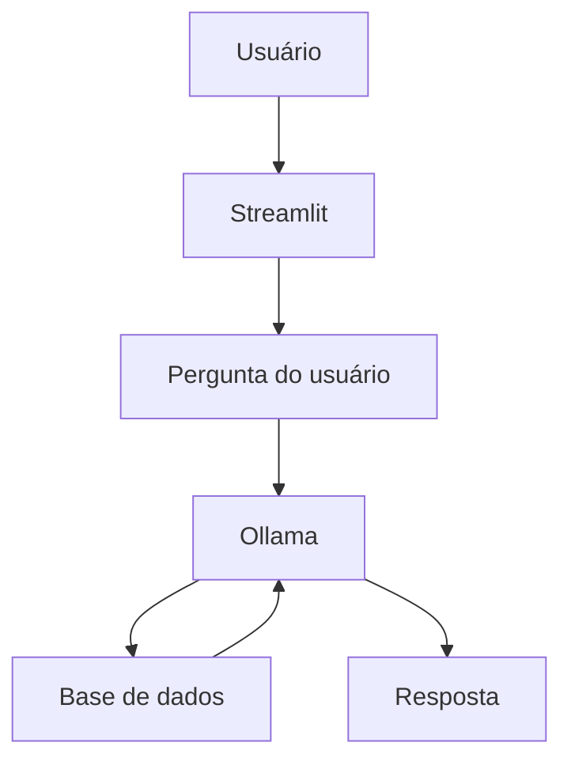

# Assistente Financeiro

### Desafio

  A proposta é a criação de um chatbot de IA que, a partir de dados mockados, tira dúvida sobre assuntos financeiros. Tudo é rodado localmente.

### Requisitos

  Rodado na versão 3.12 do Python, foram usadas as seguintes bibliotecas:

  | Biblioteca | Versão |
  |---------|----------|
  | Pandas | 2.3.3 |
  | Requests | 2.34.2 |
  | Streamlit | 1.58.0 |
  | Json | 2.0.9 |

### Estrutura do Projeto

```
├── avaliação/                     #teste do aplicativo
│   └── README.md                  #prints de conversa para avaliar funcionamento
│
├── data/                          #base de conhecimento
│   ├── perfil_investidor.json     #perfil do cliente
│   ├── transacoes.csv             #histórico de transações
│   ├── historico_atendimento.csv  #interações anteriores
│   └── produtos_financeiros.json  #produtos disponíveis
│
└── src/
    └── app.py                     #aplicação do Streamlit
```

### Desenvolvimento

#### Objetivo

  Criar uma API com o modelo escolhido para interpretar os dados de entrada e, a partir somente desses dados, tirar dúvidas do usuário sobre os produtos de investimentos disponíveis e indicar o mais adequado para ele como base no seu perfil.

#### Ferramentas e Modelo

  O framework usado no projeto foi o Streamlit, que será usado para a criação do chat interativo. 
  Para usar modelos comerciais de LLM, o Ollama foi instalado no dia 19/06/2026 pelo link abaixo (também disponível para outros sistemas operacionais na mesma página):

 https://ollama.com/download/windows

  Após o download e instalação do Ollama, dentro do próprio aplicativo instalado, foi selecionado o modelo de inteligência artificial para a interpretação dos dados e dos prompts, que é o gpt-oss. O download do modelo foi necessário e feito diretamente pela interface do Ollama.

#### Codificação e Prompts do Sistema

  O código da aplicação é o `app.py`

  Importadas as bibliotecas e abertos os dados, o primeiro passo foi criar a interface do chat, que será acessada no navegador de internet. Para isso, foi inserido o URL do Ollama e o modelo de inteligência artificial, cada um em uma variável.
  Em seguida, vieram os dois prompts que serviram como instrução para o modelo. O primeiro com as informações vindas dos dados, fornecendo ao modelo as informações sobre a vida financeira recente do cliente, bem como quais os produtos disponíveis. O segundo passava ao modelo quais são as instruções a serem seguindas para a formulação da resposta, sendo aqui a definição do objetivo do agente. Os principais objetivos traçados foram:
  - responder de forma curta porém completa;
  - possibilidade de tirar dúvidas sobre quais os tipos de invesitmentos disponíveis;
  - poder sugerir os investimentos mais adequados ao perfil, mas nunca dar ordens de comprar tal produto;
  - quando a pergunta for sobre algo que não está nos dados, dizer que não sabe.
  Por fim, foi criada a função de uso do chatbot usando o Streamlit, usando o contexto e as regras como base, e enviando as perguntas feitas pelo usuário para o Ollama. Além disso, como título da aplicação, foi colocado o nome "Assistente Financeiro". Ao longo do tempo, houveram 2 alterações nesse trecho para melhoria do código original. São elas:
  - 1ª alteração: as mensagens uma vez enviadas permaneceriam no histórico do chat até seu fechamento, bem como suas repostas, permitindo ao usuário a consulta do que já foi perguntado e quais as repostas;
  - 2ª alteração: como a alteração anterior retirou as reticências da tela enquanto a pergunta era processada, foi necessário essa nova mudança para retornar essa característica. O principal objetivo aqui for deixar claro ao usuário que a aplicação seguia em funcionamento normal.
  Os trechos incluídos e excluídos aparecem no histórico de versão.

#### Arquitetura da Aplicação



### Como Executar

  `Lembrete: todos os Requisitos devem ser cumpridos e os downloads necessários devem ter sido feitos`
  
  Primeiramente, deve-se inicializar o Ollama abrindo um Prompt de Comando e digitando:

```bash
ollama serve
```

  Depois, inicia-se o aplicativo também no Prompt de Comando:

```bash
streamlit run app.py
```

  Ao rodar esse segundo código, a janela do navegador com o chat será aberta, com o usuário podendo começar a perguntar.

  
  
  `prova de funcionamento do chat`

  Teste de uso do aplicativo em `avaliação/README.md `

### Sugestões para Melhoria

- Aumentar a base de dados: difícil devido à LGPD, mas não impossível;
- Resposta para qualquer usuário: esse aplicativo parte do princípio que o usuário é o cadastrado nos dados. Essa alteração propõe que ele continue respondendo às perguntas sobre os produtos, porém, para sugerir algo, deve perguntar, educadamente, o nome do usuário. Dessa forma, é feita a consulta do nome no banco de dados. Com retorno positivo, a recomendação é feita, caso contrário, ele diz que não pode ajudar com isso.
